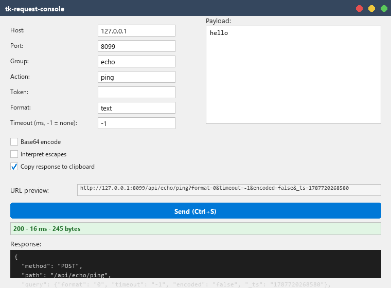

# tk-request-console

A Tkinter desktop console for hand-crafting and firing HTTP request/response
messages against a fully config-driven endpoint template.

It is for anyone who has to poke a request/response HTTP service by hand,
repeatedly: describe the endpoint shape **once** in `config.json` (scheme,
port, path template, query parameters, format codes, boolean style, token
handling), and the GUI becomes a typed form for that protocol — host, group,
action, token, format, timeout, encoding switches, free-text payload — with
the built URL always visible, the response pane copyable, and named profiles
for the requests you repeat. The same engine is available headless as a CLI,
so it doubles as a scriptable client. A bundled stdlib echo server makes the
whole thing runnable by a stranger in under a minute.



## Quickstart

```bash
uv sync
uv run python scripts/echo_server.py          # terminal 1 — a local target to hit
uv run tk-request-console --profile profiles/echo.json   # terminal 2
```

Press **Ctrl+S** (or click Send). The status bar shows `200`, an elapsed
time, and a byte count; the response pane fills with the echoed JSON body.

Prefer the CLI? Same round trip, no window:

```bash
uv run tk-request-console send --profile profiles/echo.json --json
```

## The config model

`tk-request-console` never hardcodes an endpoint shape. On startup it looks
for `--config PATH`, then `./config.json`, then falls back to built-in
defaults (which match `config.example.json`) — the app always starts, even
with no config file at all. Copy `config.example.json` to `config.json` and
edit it to describe your own service; string values may reference
`${ENV_VAR}` and are expanded from the environment (see [.env](#env-and-secrets)
below), so no token or internal hostname needs to be committed.

```json
{
  "endpoint": {
    "scheme": "http",
    "default_host": "127.0.0.1",
    "default_port": 8080,
    "method": "POST",
    "path_template": "/api/{group}/{action}",
    "query": {
      "token": "{token}",
      "format": "{format}",
      "timeout": "{timeout}",
      "encoded": "{encoded}",
      "_ts": "{timestamp}"
    },
    "format_codes": { "text": 0, "json": 1, "xml": 2, "form": 3 },
    "bool_style": "true_false",
    "token_mode": "auto",
    "omit_empty_params": true,
    "verify_tls": true
  },
  "labels": { "host": "Host", "group": "Group", "action": "Action",
              "token": "Token", "fmt": "Format",
              "timeout": "Timeout (ms, -1 = none)" },
  "directory": { "enabled": false, "url": "", "code_field": "code",
                 "name_field": "name", "host_field": "host", "timeout_s": 5.0 },
  "profiles_dir": "profiles",
  "log_file": ""
}
```

### Placeholders

`path_template` and every `query` value are Python format strings restricted
to this set:

| Placeholder | Meaning |
|---|---|
| `{host}` | The host field's current value |
| `{port}` | The port field's current value |
| `{group}` | The group field |
| `{action}` | The action field |
| `{token}` | The token, normalized per `token_mode` |
| `{format}` | The format name, looked up in `format_codes` |
| `{timeout}` | The timeout field (milliseconds; `-1` means no client timeout) |
| `{encoded}` | Whether the payload was base64-encoded, rendered per `bool_style` |
| `{timestamp}` | Milliseconds since epoch at send time |

Using any other name raises a config error naming the placeholder.
`docs/protocol.md` works through two full protocol shapes end to end.

## Profiles

A profile is a saved request: host, port, group, action, token, format,
timeout, the two encoding checkboxes, and the payload text, plus a `name`
and `description`. Three ship in `profiles/`:

- `echo.json` — a plain-text ping against the bundled echo server.
- `json-post.json` — a small JSON body, no base64.
- `form-post.json` — escape interpretation turned on, using `\0` as a field
  separator to demonstrate that feature end to end.

Load one from **File → Open profile…**, or save your current form with
**File → Save profile as…**. Headlessly:

```bash
uv run tk-request-console url --profile profiles/json-post.json
uv run tk-request-console send --profile profiles/json-post.json --host 10.0.0.5
uv run tk-request-console profiles
```

## CLI reference

```
tk-request-console [gui] [--config PATH] [--profile PATH]
tk-request-console url --profile PATH [--host HOST] [--json]
tk-request-console send --profile PATH [--host HOST] [--port PORT]
                         [--payload TEXT | --payload-file PATH] [--json]
tk-request-console profiles [--dir PATH]
tk-request-console config-check [--config PATH]
```

- `url` prints the URL that would be requested — no network call.
- `send` performs the request; exit code is `0` on a 2xx response, `1` on a
  non-2xx response, `2` on a transport-level failure (connection refused,
  DNS failure, timeout, ...). `--json` prints `{url, status, elapsed_ms, body}`.
- `config-check` validates a config file and prints the resolved effective
  configuration, or fails with a message naming the offending key.

## .env and secrets

Copy `.env.example` to `.env` and put real values there — they never need to
be committed, because `config.json` references them as `${VAR_NAME}` and
`.env` is loaded automatically before config resolution.

The optional host directory (`directory.enabled`) fetches a JSON list of
`{code, name, host}` entries from `directory.url` and feeds them into the
host field's autocomplete dropdown — a generalized, opt-in replacement for
the kind of internal store-lookup service this tool is meant to front. It
ships **disabled**, on purpose: a public config file is not the place to
point at an internal service URL, even a harmless one.

## Design notes

- **Threaded send.** The network call runs on a background thread; the
  result is marshalled back to the Tk main loop with `widget.after(0, ...)`,
  so a slow or hanging endpoint never freezes the window.
- **Live URL preview.** The exact URL that would be sent is rebuilt on every
  keystroke (with the token masked) and shown above the Send button, instead
  of only being revealed after the request goes out.
- **A rewritten autocomplete dropdown.** `AutocompleteEntry` positions its
  suggestion list as a borderless `Toplevel` anchored to the entry's real
  screen coordinates, so it lands in the right place inside any layout;
  matching is case-insensitive with prefix matches ranked first, and the
  list closes on focus loss or an empty query.
- **A token-redacting logger.** Every outgoing request is logged at INFO,
  but the token value is replaced with `***` before it ever reaches a log
  record — file logging is also off by default (`log_file: ""`).

## Development

```bash
uv sync --frozen --dev
uv run ruff check .
uv run ruff format --check .
uv run pytest -q                    # Windows: exercises the native Tk widgets
xvfb-run -a uv run pytest -q        # Linux: same, under a virtual display
```

Packaging a local executable (not something this repo ships or commits) is a
one-liner if you want it:

```bash
uv run pyinstaller --onefile --name tk-request-console src/tk_request_console/__main__.py
```

## License

MIT — see [LICENSE](LICENSE).
